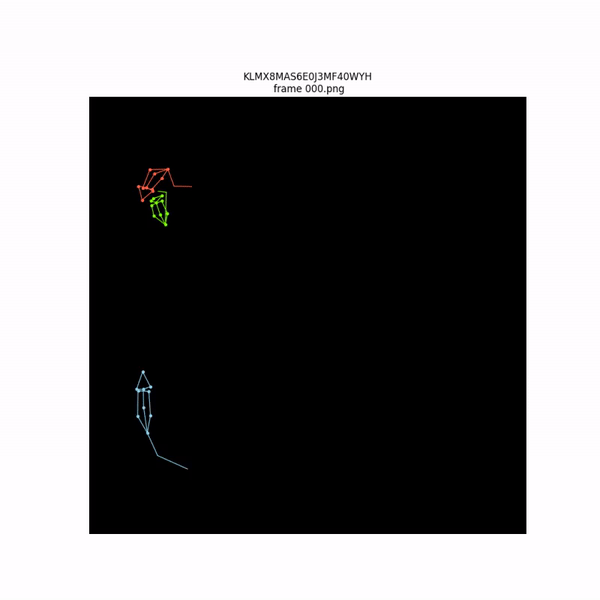

# Modified Social Attention for Animal Behaviour Prediction
 This repository comprises files related to the implementation of [Social Attention](https://arxiv.org/abs/1710.04689) as applied to the mouse triplet dataset. The structure of the ST graph has been modified to accommodate spatial and temporal interactions between various keypoints on the mouse for comprehensive behavior comprehension. The repository is currently in a preliminary stage, and further refinements are anticipated.
 

